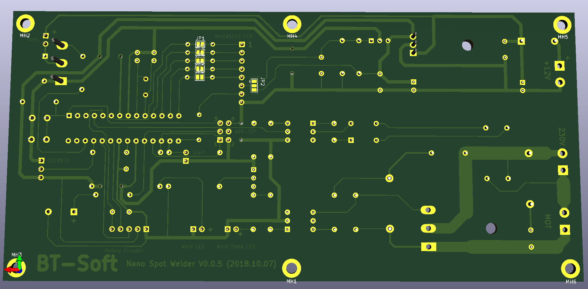

# NanoSpotWelder-3
Pulse counter spot welder with ATmega328P microprocessor

Full description of the project: [https://electrodiy.blog.hu/](https://electrodiy.blog.hu/2019/01/12/impulzusszamlalos_ponthegeszto_atmega328p_avr_mikrokontrollerrel_v0_0)

